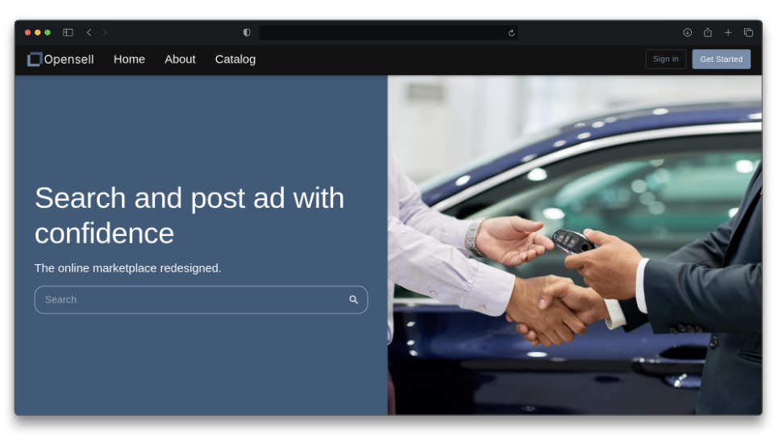

# Opensell 2.0

Opensell is a website for buying and selling ads that we initially made in the course 420-412-MV(project - development of a web application) at Cegep Marie-Victorin between January and May 2024. In the summer of the same year, the UI of the website was optimized and redesigned using the library MUI. The backend was optimized too and the original database(Mariadb) was replaced with MongoDB and by doing so, all the old SQL entities and queries where replace by documents and mongodb queries.  

<!-- Need to put some icon that give info -->


## Features

- Login and sign up.
- Creating and modifying ads.
- Searching ads with multiples filter like price range, category, tags, shape and many more.
- Changing information about our account like our phone number, bio, picture, etc.

## Technologies

### Database

- MongoDB

### Backend

- Java
- Spring Boot
- Lombok
- docker-compose

### Frontend

- Typescript
- React
- Axios
- MUI

## Installation
<!-- Dependencies -->
<details open><summary><b>External dependencies</b></summary>

- [nodejs](https://nodejs.org/en/download/prebuilt-installer)
- [docker](https://www.docker.com/get-started/)
- [JDK 21](https://www.oracle.com/ca-en/java/technologies/downloads/#java21)

</details>
<br />

<!-- Images section -->
<details open><summary><b>Images Server</b></summary>

Setup :
```shell
git clone https://github.com/HMDOC/opensell-images
npm install
```

</details>
<br />

<!-- Backend section -->
<details open><summary><b>Backend</b></summary>

Setup :
```
git clone https://github.com/HMDOC/opensell-backend
```

Create the file `env.properties` in the root folder that contains this :
```properties
# The port of the backend.
SERVER_PORT=

# The url of the SMTP server. Ex: smtp-mail.outlook.com
SMTP_HOST=

# The port of the SMTP server. Ex: 587
SMTP_PORT=
SMTP_EMAIL=
SMTP_PASSWORD=

# The url that can make request to the backend. The only one you need is the one of the frontend
ALLOWED_URLS=

# The path where the image are going to be stored. This path should end with /public if you are using the image server.
IMAGE_SERVER_PATH=

# The url of the server that contain the image. Ex: http://localhost:$PORT
IMAGE_SERVER_URL=

# The information that will be given directly to the MongoDB container.
MONGO_INITDB_ROOT_USERNAME=
MONGO_INITDB_ROOT_PASSWORD=
MONGO_INITDB_ROOT_DATABASE=
```

After running the project, you need to connect to the database container with [MongoDB Compass](https://www.mongodb.com/try/download/compass). After you need to import the data of the collections adCategory, customer and ad located at `./src/main/ressources/data`. The import order is adCategory.json, customer.json and ad.json.
</details>
<br />

<!-- Frontend section -->
<details open><summary><b>Frontend</b></summary>

Setup :
```
git clone https://github.com/HMDOC/opensell-frontend
cd opensell-frontend/
npm install
```

Create a file named `.env.local` in the root folder with this content :
```properties
# Port of the frontend
VITE_PORT=80
VITE_BACKEND_URL=
VITE_JWT_SECRET_KEY=

# URL of the image server, should finish with a /
VITE_IMAGES_SERVER_URL=

VITE_AD_IMAGES_FOLDER=ad-image/
VITE_CUSTOMER_PROFILE_FOLDER=customer-profile/
```
</details>

## Run the project

```sh
# Frontend
npm run dev

# Backend: run with your IDE or :
./mvnw spring-boot:run

# Images
npm start
```

## Preview


